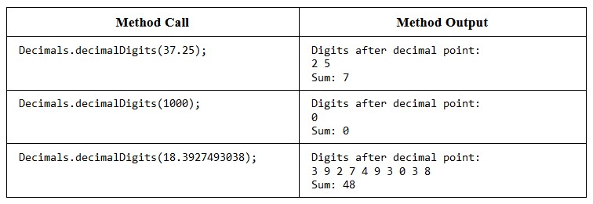
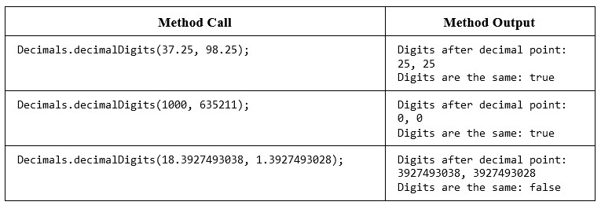
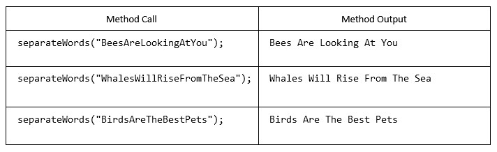

###### CS-207-3: Programming II   Spring 2021   Northeastern Illinois University   Workshop Week 4   Strings, Part I & II

**Getting Started**

**1.** Detailed instructions are located in the tutorial videos. 
**2.** Accept the assignment invitation on D2L. 
**3.** Clone the assignment to your computer. 
**4.** Go to File > Project Structure. Under Project Settings, click on Project and verify that the Project SDK is set
to JDK 11 or higher.  If it is not, select the correct SDK from the drop-down. 
**5.** Go to File > Settings (Mac: IntelliJ IDEA > Preferences). Under Build, Execution, Deployment and under Build
Tools, click Gradle. Make sure Build and run using: and Run tests using: are set to Gradle. Make sure Use Gradle from:
is set to 'gradle-wrapper.properties' file. And make sure Gradle JVM is set to JDK 11 or higher. 
**6.** Project SDK and Gradle JVM should be set to the same Java version. 
**7.** Create the main/java directory in the src directory. This is where you will be creating your Java classes for
your assignment. Right click src and go to New > Directory and select main/java. 

### Problem 1

**1.** In the main/java directory, create a class named `Decimals`.
- Write a static method named `decimalDigits` that takes a double as a parameter and returns a String.
  The method should return a single String of 3 lines: the first line should be "Digits after decimal point: ",
  the second line should be the digits after the decimal point separated by spaces (do not include the decimal point),
  and on the third line should be the sum of all of the digits after the decimal point.
    - Uncomment the first 3 tests in the `DecimalsTest` class (in the `test/java`
      directory). Run the tests. Run the code analyzers and commit your code now.

**Additonal Rules.** You can only use wrapper classes and the String methods: length(), charAt(),  indexOf(). You may use at most one loop and there should be no conditional blocks inside of your  loop. 
 

**2.** In the same class (`Decimals`):
- Write an overloaded static method named `decimalDigits` that takes two doubles as parameters and returns a String.
  The method should return a single String of 3 lines: the first line should be "Digits after decimal point: ",
  the second line should be the digits after the decimal point for each of the decimals (do not include the decimal point) separated by a comma and a space,
  and on the third line should indicate whether the decimal digits for the two parameters are exactly the same - match the sample output provided below.
    - Uncomment the last 3 tests in the `DecimalsTest` class (in the `test/java`
      directory). Run the tests. Run the code analyzers and commit your code now.

**Additonal Rules.** You can only use the String methods: length(), charAt(), indexOf(),  substring(), replace(), contains(), or equals(). You may not use any loops or conditional  blocks.

### Problem 2

**1.** In the main/java directory, create a class named `Words`.
- Write a static method named `separateWords` that takes a String as a parameter and returns a String.
  The method should break the parameter into individual words based on capital letters.
  The  method should print out each word (including the capital letter) on the same line, separated by spaces.
  You can assume that the parameter always starts with a capital letter.
    - Uncomment the tests in `WordsTest` class (in
      the `test/java` directory). Run the tests. Run the code analyzers and commit your code now.

